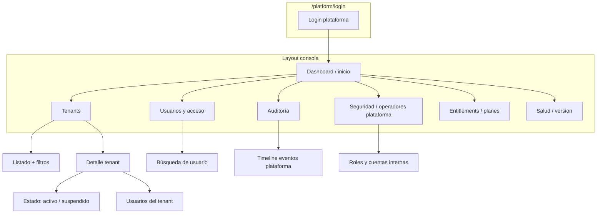

# Fase 1 — Entregables: diseño del admin de plataforma (completada)

**Fecha de cierre:** 2026-04-29  
**Referencias:** [PLATFORM-ADMIN-FASES.md](PLATFORM-ADMIN-FASES.md) · [ADRs](adr/README.md)

## Resumen ejecutivo

Se fijan decisiones de producto y arquitectura para un **operador de plataforma** (identidad, JWT, políticas, superficie `api/platform`, riesgos). La implementación corre en **Fase 2 en adelante**; el código de producción **no** forma parte de esta fase (según criterio del plan original).

| Entregable | Ubicación |
|------------|------------|
| ADR: modelo de identidad | [adr/0001-platform-identity-model.md](adr/0001-platform-identity-model.md) |
| ADR: JWT y policies | [adr/0002-platform-jwt-and-authorization.md](adr/0002-platform-jwt-and-authorization.md) |
| ADR: API host y riesgos | [adr/0003-platform-api-host-and-surface.md](adr/0003-platform-api-host-and-surface.md) |
| Matriz RBAC (este doc) | Tablas siguientes |
| Mapa de navegación (front) | Mermaid y lista de pantallas |

---

## Matriz RBAC — roles de plataforma (Identity / policies)

> Los nombres exactos de rol son convención; al implementar Fase 2–3 se crearán en Identity. Las **policies** unifican el acceso en API.

| Rol (Identity) | Policy ASP.NET (ejemplo) | Qué puede hacer (categoría de casos de uso) |
|----------------|-----------------------------|---------------------------------------------|
| `Platform.SupportReadOnly` | `Platform.ReadOnly` o `Platform.User` + comprobación de método GET | Listar tenants (paginado), listar audit read-only, export acotado, health/version. **Sin** POST/PUT/DELETE. |
| `Platform.Support` (opcional) | `Platform.Operations` (subset) | Mismo + acciones de soporte acotadas (p. ej. reenviar reset de usuario) según fases 6–7, **con motivo** obligatorio. |
| `Platform.Operations` | `Platform.Operations` | CRUD tenants (Fase 5), suspender/reactivar, asignar entitlements (Fase 9), gestión de usuarios cross-tenant (Fase 6). **Sin** crear operadores plataforma. |
| `Platform.SuperAdmin` | `Platform.SuperAdmin` | Todo lo anterior + provisionar/retirar operadores plataforma, asignar roles de plataforma, configuración riesgosa. |

| Recurso / ruta (futuro) | SupportReadOnly | Support* | Operations | SuperAdmin |
|------------------------|----------------|----------|------------|------------|
| `GET /api/platform/health` | Sí | Sí | Sí | Sí |
| `GET /api/platform/tenants` | Sí | Sí | Sí | Sí |
| `POST/PUT/DELETE /api/platform/tenants` | No | Sí* | Sí | Sí |
| `GET /api/platform/tenants/{id}/users` | Sí | Sí | Sí | Sí |
| Mutar usuarios / invitaciones (Fase 6) | No | Condicional | Sí | Sí |
| Suplantación / token efímero (Fase 7) | **No** | Sí (si se define) | Sí | Sí |
| Export auditoría (Fase 10) | Sí (límite) | Sí | Sí | Sí |
| Crear operador plataforma | **No** | **No** | **No** | Sí |

\*Rol `Platform.Support` requiere definir exactamente el subconjunto en Fase 6; si se omite, solo `Operations` y `SuperAdmin` mutan.

---

## Mapa de navegación — consola plataforma (front)

**Ruta base:** `/platform` (módulo o aplicación distinta al POS, ADR 0003).

### Lista mínima de pantallas (v1 producto)

1. **Login** — solo consola; branding distinto al POS.  
2. **Dashboard** — KPIs agregados o enlaces a secciones (Fase 13 completa el contenido).  
3. **Tenants** — tabla paginada, detalle, acciones (según matriz).  
4. **Usuarios (cross-tenant)** — búsqueda por email/tenant, acciones auditadas.  
5. **Auditoría** — listado de eventos con filtros (Fase 10).  
6. **Operadores plataforma** (solo SuperAdmin) — CRUD de cuentas y roles.  
7. **Entitlements / plan** (Fase 9) — asociación a tenant.  
8. **Salud** — versión de API, estado básico (Fase 4+).

---

## Riesgos catalogados (para trazabilidad con ADR 0003)

- Suplantación o acceso masivo a datos PII.  
- Confundir `tenant_id` en JWT con tenant objetivo de la operación.  
- Cuenta plataforma con contraseña débil / sin MFA (mitigación futura).  
- Export o listados sin paginado → denegación de servicio.  
- Borrado lógico de tenant **sin** bloquear logins (mitigado en Fase 5 + 8).

---

## Criterio de aceptación Fase 1 (verificación)

- [x] Tres ADRs aceptados con **contexto / decisión / consecuencias**  
- [x] Matriz de roles y permisos a nivel de categoría y rutas de ejemplo  
- [x] Mapa de pantallas o diagrama de navegación mínimo  

**Próximo paso recomendado:** Fase 2 (dominio + modelos) según [PLATFORM-ADMIN-FASES.md](PLATFORM-ADMIN-FASES.md#fase-2--dominio-identidad-y-contexto-de-plataforma-domain--application).
